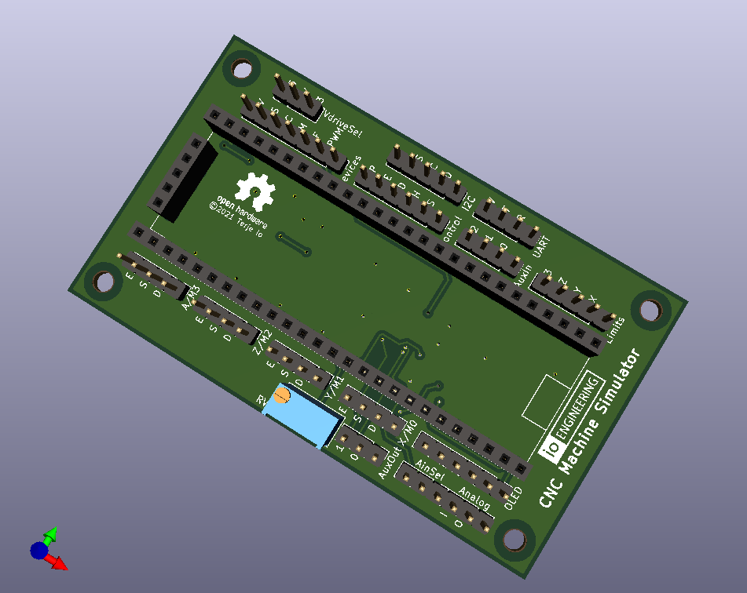

## CNC Machine Simulator

#### *** PRELIMINARY ***

First batch of boards \(for final design verification\) to be ordered soon.

**NOTE:** design files are in [KiCad 5](http://www.kicad.org/) format!

**Features:**

* Board based on a Cypress CY8CKIT-059 devkit \(PSoC 5\).

* OLED display showing motor pulse counts and status information.

* 3.3v or 5v signalling.

* Step, dir and enable inputs for up to four motors.

* Four limit pins outputs with configurable trigger count can be used to simulate auto-squaring.

* Signal outputs for reset/E-stop, safety door, feed hold, cycle start and aux input 0 - 2. Aux 0 and 1 can be used to generate spindle encoder signals.

* Device control inputs for spindle on, spindle dir, flood, mist aux output 0 and 1.

* 5v I2C port.

* 5v UART port - can be used to simulate VFD.

* Analog output for simulating arc voltage.

* PWM/analog input for spindle RPM control.

---

2021-10-21
